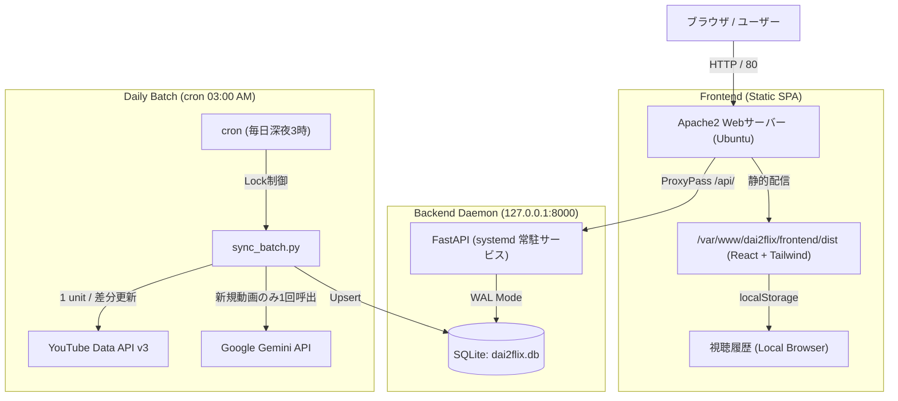

# DAI2FLIX (だいにぐるーぷ特化型 Netflix風動画Webアプリ)

[](https://github.com/your-username/dai2flix/actions)


YouTubeクリエイター「だいにぐるーぷ」の動画資産（公式再生リストおよび最新動画）を、NetflixライクなリッチUI/UXで閲覧・視聴できるWebアプリケーションです。
自宅のUbuntu Server + Apache2環境において**「完全放置運用（メンテナンスフリー）」**を成立させるため、障害点の極小化、防御的設計、厳格な非機能要件を遵守して構築されています。

---

## 🌟 主な機能と特徴

1. **NetflixライクなリッチUI/UX**:
   - **Billboard**: 画面上部に配置される全幅ヒーローバナー。大型企画（逃亡生活、心理戦など）を自動選定。
   - **Horizontal Rows**: 公式再生リスト単位のRow、およびAIムードタグ横断Row（#極限の心理戦、#逃亡劇など）のスムーズな横スクロールスライダー。
   - **Card Hover**: マウスホバーで拡大表示（`scale-105`）、AIキャッチコピー、再生時間、視聴回数、ムードタグの表示。
   - **YouTube IFrame Modal Player**: 公式埋め込みプレイヤーによるシームレスな再生（`rel=0`、自動再生制御、ESCキー対応）。

2. **認証不要の軽量パーソナライズ**:
   - ブラウザの `localStorage` により視聴履歴をローカル管理。
   - 「最近観た作品（もう一度観る）」Rowを、ログイン不要で動的に最上位へ自動挿入。
   - サーバー側にユーザー認証テーブルを持たせないことで、個人情報リスクゼロ・保守工数ゼロを実現。

3. **クオータ・コスト極小化バッチ**:
   - 高コスト（100ユニット）な `search.list` を一切排除し、`playlists.list` / `playlistItems.list` / `videos.list`（1ユニット/50件）のみで差分取得。
   - Google Gemini API によるメタデータ自動付与（キャッチコピー、100字あらすじ、ムードタグ）は**新規動画検知時の初回1回のみ**実行してSQLiteへ永続化。

4. **堅牢なインフラ設計**:
   - **SQLite WALモード**: 高並行読み込み・書き込み耐性、クラッシュ時の耐久性向上。
   - **多重起動防止**: PID検証付き排他ロック（`BatchLock`）によるcron重複実行の完全阻止。
   - **systemdデーモン化**: クラッシュ時の自動再起動（`Restart=always`）とプロセス隔離。
   - **Apache2リバースプロキシ**: 静的SPA配信、SPAルーティング、機密ファイル遮断（`.env`, `.db`, `.sqlite3` 等へのWebアクセス完全拒否）。

---

## 📐 システムアーキテクチャ



---

## 🛠 技術スタック

| 分野 | 技術・ツール |
| :--- | :--- |
| **Webサーバー / プロキシ** | Apache 2.4 (mod_proxy, mod_deflate, FallbackResource) |
| **バックエンド** | Python 3.10+ / FastAPI / Uvicorn / SQLAlchemy 2.0 / Pydantic v2 |
| **データベース** | SQLite 3 (WALモード有効化 / PRAGMA同期) |
| **データ同期** | YouTube Data API v3 (REST) / Google GenAI SDK (Gemini 2.5 Flash) |
| **フロントエンド** | React 18 / TypeScript / Vite / Tailwind CSS / Lucide Icons |
| **プロセス管理** | systemd (`dai2flix-backend.service`) |
| **スケジューリング** | cron / logrotate |

---

## 🚀 ローカル開発環境のセットアップ

### 1. リポジトリのクローンと環境変数の準備

```bash
git clone https://github.com/your-username/dai2flix.git
cd dai2flix

# バックエンド用 .env の作成
cp backend/.env.example backend/.env
# backend/.env を開き、YOUTUBE_API_KEY, GEMINI_API_KEY, CHANNEL_ID を入力
```

### 2. バックエンドの起動

```bash
# 仮想環境の作成とライブラリ導入
python -m venv .venv
source .venv/bin/activate  # Windows: .\.venv\Scripts\Activate.ps1
pip install -r backend/requirements.txt

# 初期同期バッチのテスト実行 (モックまたはAPIキー利用)
python backend/scripts/sync_batch.py

# APIサーバー起動
uvicorn app.main:app --app-dir backend --reload --port 8000
```
- APIドキュメント（Swagger UI）: `http://127.0.0.1:8000/docs`
- ヘルスチェックAPI: `http://127.0.0.1:8000/api/health`

### 3. フロントエンドの起動

```bash
cd frontend
npm install
npm run dev
```
- フロントエンド開発サーバー: `http://localhost:5173`

---

## 🧪 テストの実行

外部APIへ実リクエストを送ることなく、モック化された単体テストおよびFastAPI TestClientによる結合テストを実行できます。

```bash
# バックエンド全テスト
pytest backend/tests -v

# フロントエンド型チェック＆本番ビルド
cd frontend
npm run build
```

---

## 📖 本番デプロイ手順

本番Ubuntu Server + Apache2環境へのセットアップ・デプロイに関する完全な手順は、
[DEPLOYMENT_GUIDE.md](DEPLOYMENT_GUIDE.md) を参照してください。

---

## 📄 ライセンス・免責事項

本ソフトウェアはMITライセンスのもとで公開されています。
動画およびサムネイルのすべての権利は、YouTubeクリエイター「だいにぐるーぷ」様およびYouTube運営会社に帰属します。
